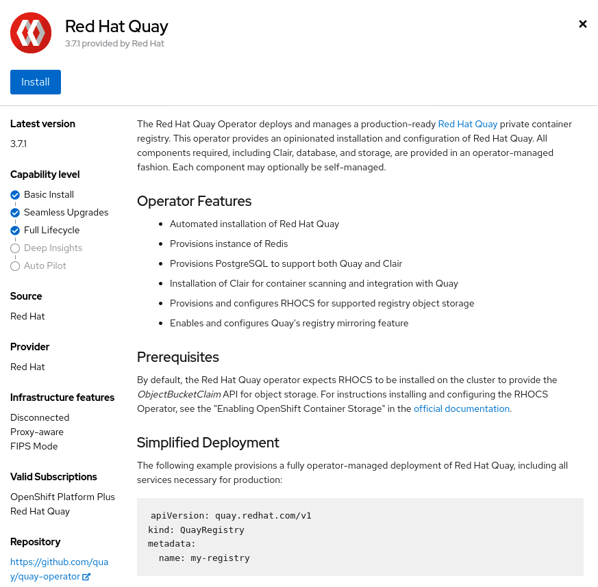

= 01 Quay Installation

== Installing the Quay Security Operator

=== Installing the Quay Security Operator from the OpenShift console

. Using the OpenShift console, Select Operators -> OperatorHub, then select the Quay Container Security.
+

. The Installation page outlines the features and prerequisites:
+
image:images/operator-install-page-cso.png[]
. Select Install. The Operator Installation page appears.
+
image:images/operator-subscription-cso.png[]
. The following choices are available for customizing the installation:

* **Update Channel:** Choose the update channel, for example, `stable-3.6` for the latest release.

* **Installation Mode:** Choose  `All namespaces on the cluster` if you want the Operator to be available cluster-wide. Choose `A specific namespace on the cluster` if you want it deployed only within a single namespace. It is recommended that you install the Operator cluster-wide. If you choose a single namespace, the monitoring component will not be available by default.

* **Approval Strategy:** Choose to approve either automatic or manual updates. Automatic update strategy is recommended.

. Select Install.

. After a short time, you will see the Operator installed successfully in the Installed Operators page.

=== Installing the Quay Security Operator from the CLI

```sh
$ oc apply --kustomize ./kustomize/container-security-operator/base
```
== Installing the Quay Operator

=== Installing the Quay Operator from the OpenShift console

. Using the OpenShift console, Select Operators -> OperatorHub, then select the Red Hat Quay Operator. If there is more than one, be sure to use the Red Hat certified Operator and not the community version.
+
image:images/operatorhub-quay.png[]
. The Installation page outlines the features and prerequisites:
+

. Select Install. The Operator Installation page appears.
+

. The following choices are available for customizing the installation:

* **Update Channel:** Choose the update channel, for example, `stable-3.6` for the latest release.

* **Installation Mode:** Choose  `All namespaces on the cluster` if you want the Operator to be available cluster-wide. Choose `A specific namespace on the cluster` if you want it deployed only within a single namespace. It is recommended that you install the Operator cluster-wide. If you choose a single namespace, the monitoring component will not be available by default.

* **Approval Strategy:** Choose to approve either automatic or manual updates. Automatic update strategy is recommended.

. Select Install.

. After a short time, you will see the Operator installed successfully in the Installed Operators page.

=== Installing the Quay Operator from the CLI

```sh
$ oc apply --kustomize ./kustomize/quay-operator/base
```

=== Installing Multi-Cloud Object Gateway from the CLI (out of the scope of the workshop)

More information can be found https://access.redhat.com/documentation/en-us/red_hat_quay/3.6/html/deploy_red_hat_quay_on_openshift_with_the_quay_operator/operator-preconfigure#operator-managed-storage[here
]
```sh
# install odf operator
$ oc apply --kustomize ./kustomize/odf-operator/base

# install nooba
$ oc apply --kustomize ./kustomize/noobaa-gateway/base
..
$ oc get -n openshift-storage noobaas noobaa -w
..
#  make the PersistentVolume backing store the default
$ oc patch bucketclass noobaa-default-bucket-class --patch '{"spec":{"placementPolicy":{"tiers":[{"backingStores":["noobaa-pv-backing-store"]}]}}}' --type merge -n openshift-storage
```

== Deploying the Quay instance

=== Deploying the Quay instance from the OpenShift console

. Create a namespace, for example, `quay-enterprise`.
. Select Operators -> Installed Operators, then select the Quay Operator to navigate to the Operator detail view.
. Click 'Create Instance' on the 'Quay Registry' tile under 'Provided APIs'.
. Optionally change the 'Name' of the `QuayRegistry`. This will affect the hostname of the registry. All other fields have been populated with defaults.
. Click 'Create' to submit the `QuayRegistry` to be deployed by the Quay Operator.
. You should be redirected to the `QuayRegistry` list view. Click on the `QuayRegistry` you just created to see the details view.
. Once the 'Registry Endpoint' has a value, click it to access your new Quay registry via the UI. You can now select 'Create Account' to create a user and sign in.

=== Deploying the Quay instance from the CLI

```sh
$ oc apply --kustomize ./kustomize/quay-instance/base
```

== Navigation

link:../02.Organizations/README.adoc[[Next]]