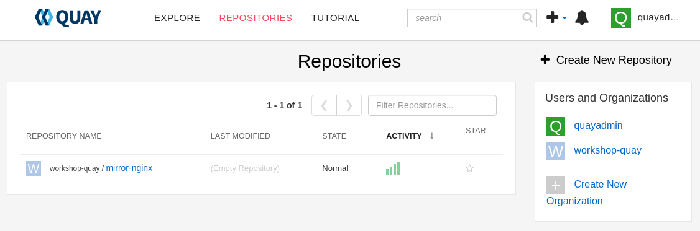

= 02 Organizations

== Create an Organization

. `Create New Organization`
+

+
* Name this Organization `workshop-quay`.
* `Create Organization`
+

## Create a Repository

* `Create New Repository`.
+

+
* Name the repository `mirror-nginx`.

* Change the `Repository Visibility` to `Public`.

* `Create Public Repository`
+

== Navigation

link:../01.Quay-Installation/README.adoc[[Previous]]|link:../03.Repo-Mirroring/README.adoc[[Next]]