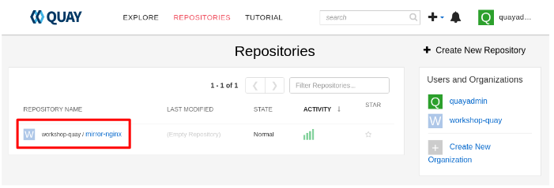
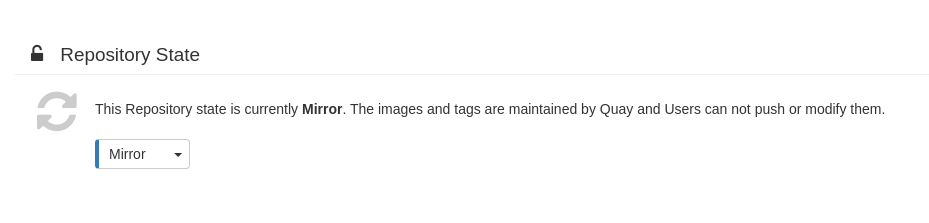
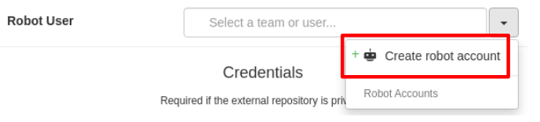
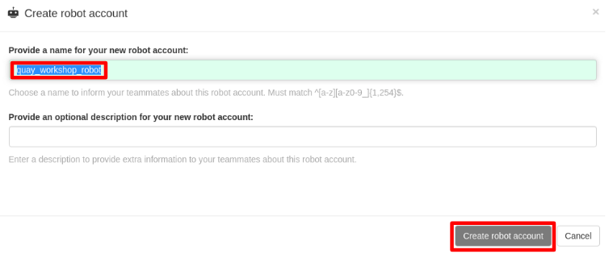

= 03 Repo Mirroring

== Create a repo to mirror from

* Select the repository `my-app` created in previous lab.
+

+
* `Settings`
* Change the Repository State to `Mirror`
+
TIP: Mirroring needs to be configured in https://access.redhat.com/documentation/en-us/red_hat_quay/3/html/configure_red_hat_quay/config-fields-intro#config-fields-mirroring[Quay]
+

+
* Select the `Mirroring tab`
+

+
* Registry Location: `docker.io/bitnami/nginx`
* Tags: `1.1*,1.20*`
* Start Date: `Today`
* Sync Interval: `10 seconds`
* `Create robot account`
+

+
* Create robot account as follows (`quay_workshop_robot`)
+

+
* `Enable Mirror`

