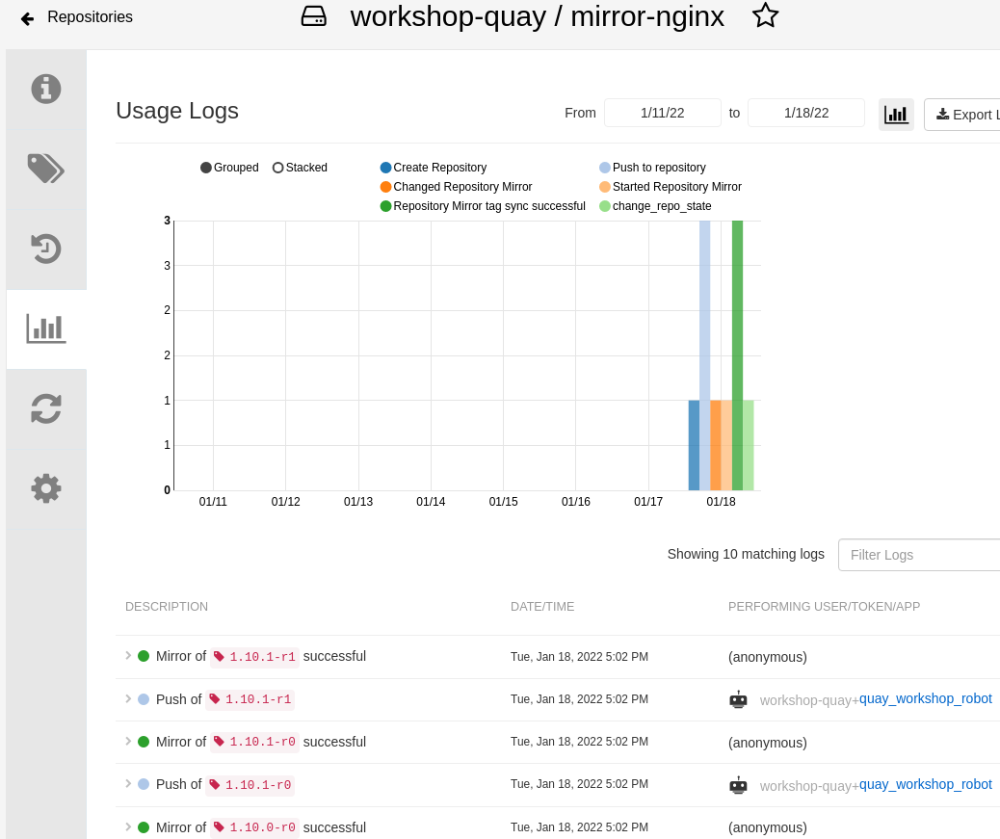

= 03 Repo Mirroring

== Create a repo to mirror from

* Select the repository `mirror-nginx` created in previous lab.
+
image:images/01-quay-dashboard.png[Quay Dashboard]
+
* `Settings`
* Change the Repository State to `Mirror`
+
image:images/02-quay-dashboard.png[Quay Dashboard]
+
* Select the `Mirroring tab`
+
image:images/03-quay-dashboard.png[Quay Dashboard]
+
* Registry Location: `bitnami/nginx`
* Tags: `1.1*,1.20*`
* Start Date: `Today`
* Sync Interval: `10 seconds`
* `Create robot account`
+
image:images/04-quay-dashboard.png[Quay Dashboard]
+
* Create robot account as follows (`quay_workshop_robot`)
+
image:images/05-quay-dashboard.png[Quay Dashboard]
+
* `Enable Mirror`

* Check the logs
+
