= 04 Inspecting image layers and CVE's

== Installing the Quay Security Operator

=== Installing the Quay Security Operator from the OpenShift console

. Using the OpenShift console, Select Operators -> OperatorHub, then select the Quay Container Security.
+
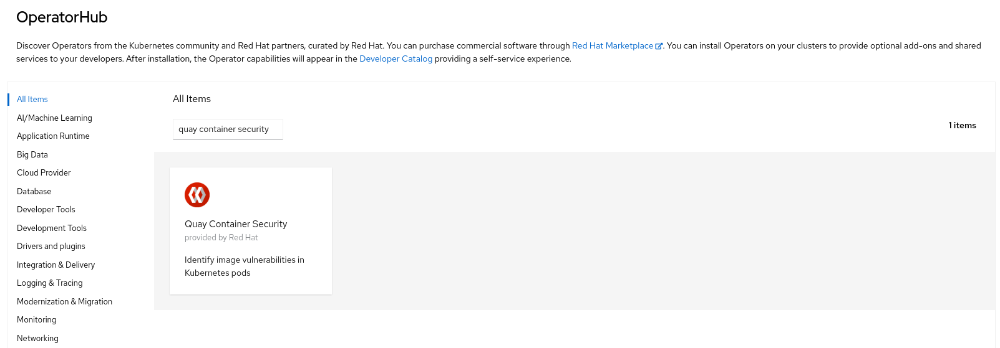
. The Installation page outlines the features and prerequisites:
+
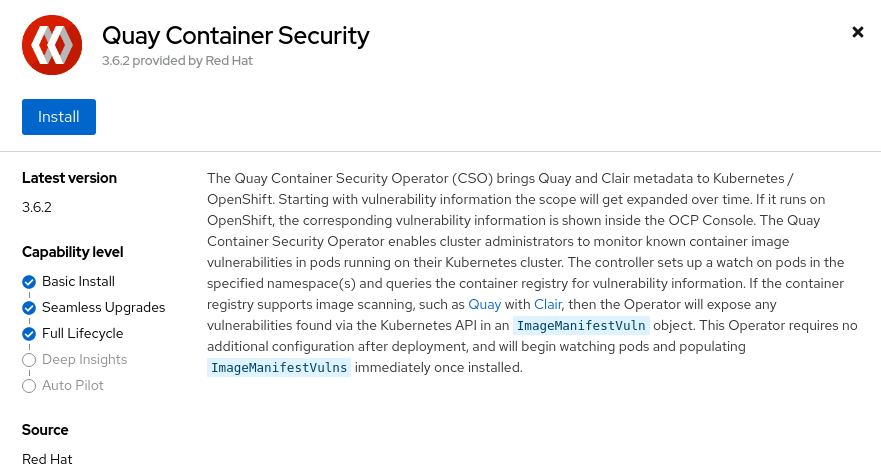
. Select Install. The Operator Installation page appears.
+
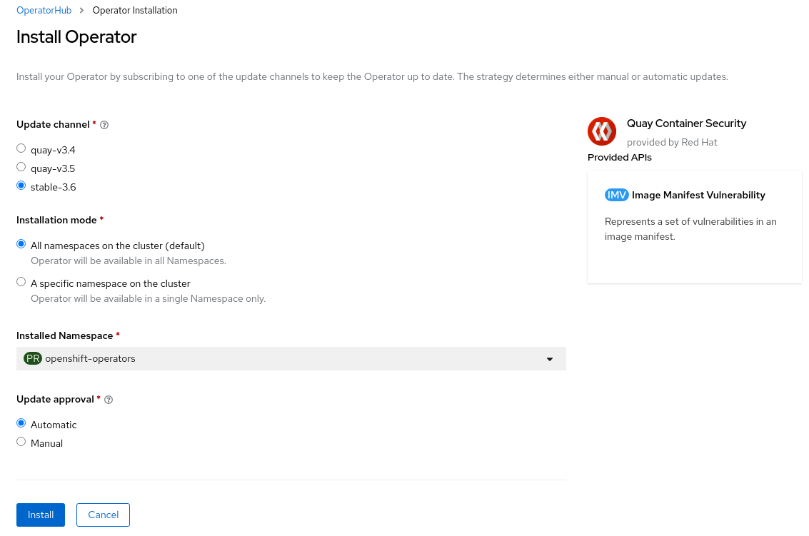
. The following choices are available for customizing the installation:

* **Update Channel:** Choose the update channel, for example, `stable-3.6` for the latest release.

* **Installation Mode:** Choose  `All namespaces on the cluster` if you want the Operator to be available cluster-wide. Choose `A specific namespace on the cluster` if you want it deployed only within a single namespace. It is recommended that you install the Operator cluster-wide. If you choose a single namespace, the monitoring component will not be available by default.

* **Approval Strategy:** Choose to approve either automatic or manual updates. Automatic update strategy is recommended.

. Select Install.

. After a short time, you will see the Operator installed successfully in the Installed Operators page.

=== Installing the Quay Security Operator from the CLI

```sh
$ oc apply --kustomize kustomize/container-security-operator/base
```

== Managing vulnerabilities using the Quay instance

* Navigate to the `workshop-quay/mirror-nginx` repository.
* Click the Tags icon on the left.
+
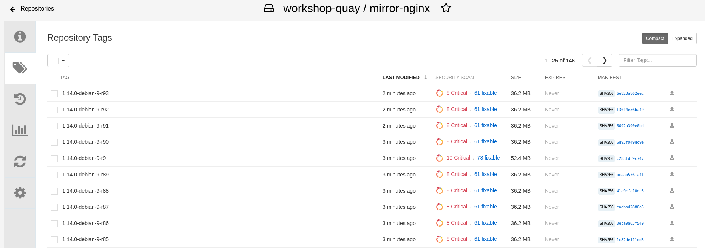
+
* You can pick any image, with several `High` and `fixable` results shown under the `SECURITY SCAN` field. Let's explore this one.
+
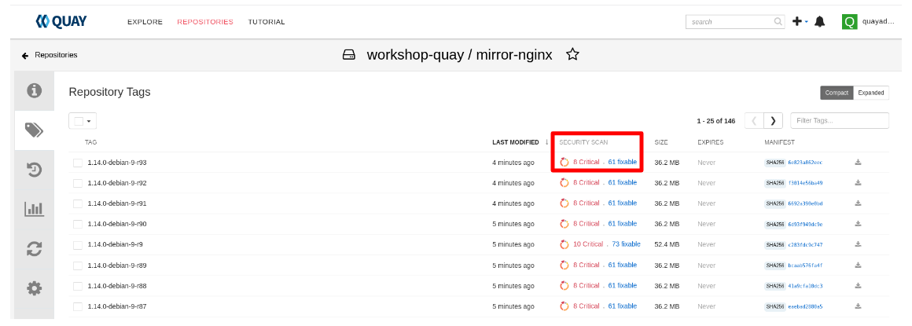
+
* Now let's explore the `SHA256` value, listed under `MANIFEST`
+
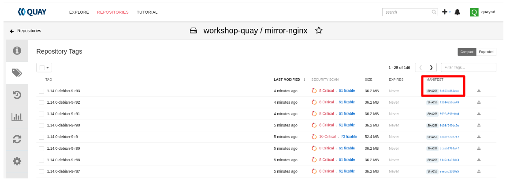
+
* You should now see the layers dashboard as depicted in the image below
+
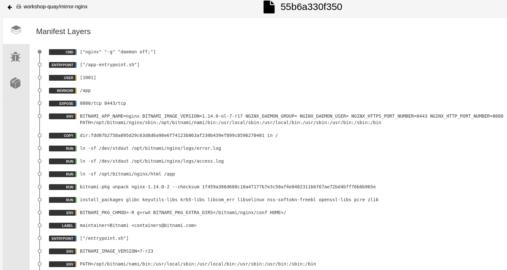
+
* Quay has extracted the various Dockerfile directives that comprise this image. Inspect the 3 directives included in this image `CMD`, `ENTRYPOINT`, and `USER`. This feature is very useful when inspecting complex images that intend to run applications.
* Click the `Security Scan` icon on the left, depicted in the image below.
+
image:images/05-quay-dashboard.png[Quay Dashboard]
+
* You should now see the Security Scan Dashboard like the picture, similar to the picture below:
+
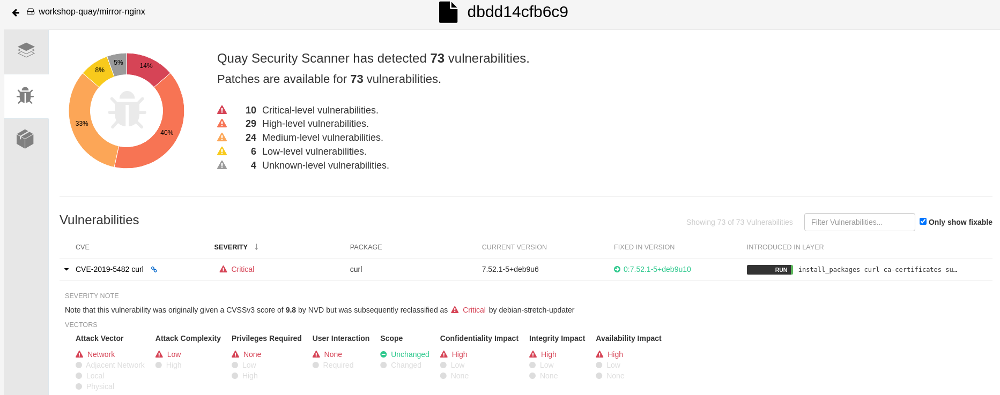
+
* Click the `Packages` icon on the left, depicted in the image below.
+

+
* You should now see the Packages Dashboard like the picture, similar to the picture below:
+
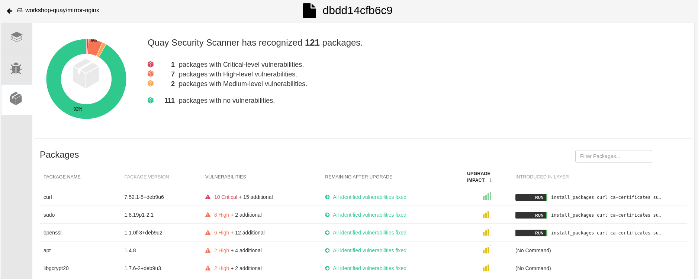

== Managing vulnerabilities using the OpenShift console (Quay Container Security Operator)

Initially the cluster is showing no image vulnerabilities, similar to the picture below:

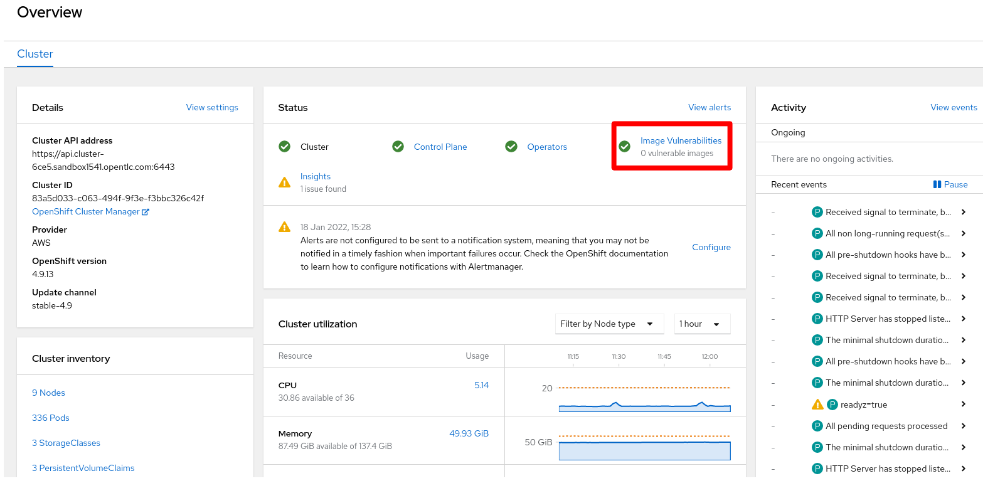

* Let's start deploying some applications and observe the behavior of the vulnerability scanning.
+
```sh
$ oc apply --kustomize kustomize/base
```
+
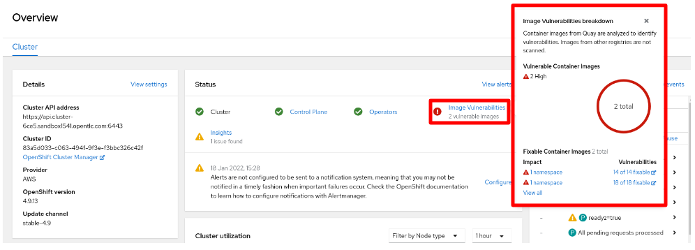
+
IMPORTANT: Container images from Quay are analyzed to identify vulnerabilities. Images from other registries are not scanned.
+
* Cick on `View all` and observe the dashboard
+
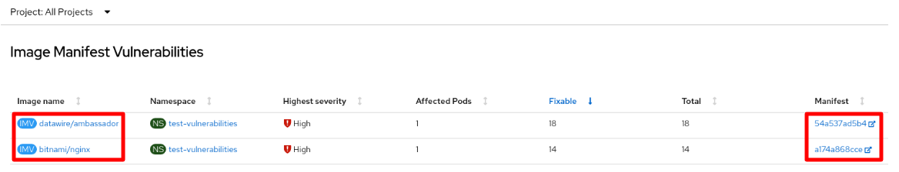
+
* Next we can click on the `Manifest` or in the `Vulnerabilities` link from the OpenShift Console and we get redirected to the quay security scan view.
+
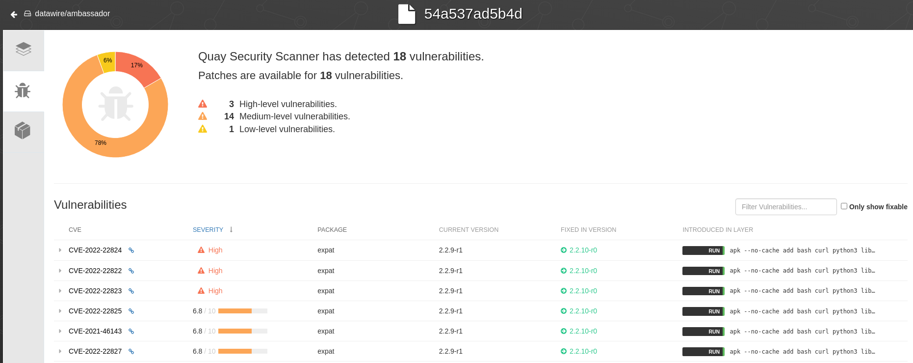
+
* Now let's pick up an image tag from the mirroring repository and deploy it to observe again how the scanning behaves:
+
```sh
$ oc create deployment test-quay --image=quay-registry-quay-quay-enterprise.apps.cluster-6ce5.sandbox1541.opentlc.com/workshop-quay/mirror-nginx:1.14.2-r9 -n test-vulnerabilities
```
+
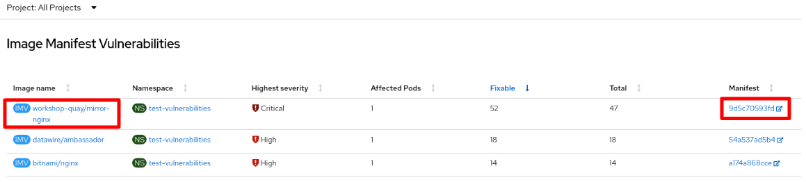
+
* If we click now on the `Manifest` we can see that it redirects you to the quay instance that contains tha repository:
+
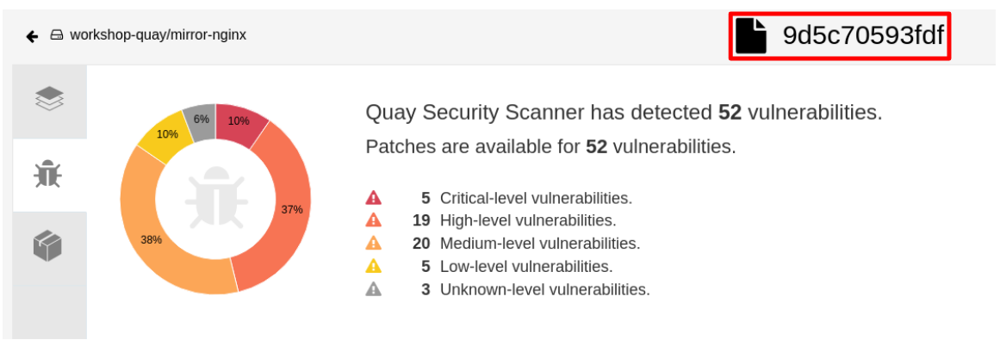

== Managing vulnerabilities using Quay across multiple clusters

.This scenario requires having at least two clusters. One cluster hosts the quay instance (quay-hub) and the other cluster (quay-peers) will have installed CSO.

* Let's deploy the same applicacions in cluster-a (quay-hub) and cluster-b (quay-peer)

```sh
<quay-hub>$ oc apply --kustomize kustomize/base
<quay-hub>$ oc create deployment test-quay --image=quay-registry-quay-quay-enterprise.apps.cluster-6ce5.sandbox1541.opentlc.com/workshop-quay/mirror-nginx:1.14.2-r9 -n test-vulnerabilities
...

<quay-peer>$ oc apply --kustomize kustomize/base
<quay-peer>$ oc create deployment test-quay --image=quay-registry-quay-quay-enterprise.apps.cluster-6ce5.sandbox1541.opentlc.com/workshop-quay/mirror-nginx:1.14.2-r9 -n test-vulnerabilities
```
* We can check that in both clusters the same vulnerabilities are available and both redirect to the same quay endpoint.

.quay-hub
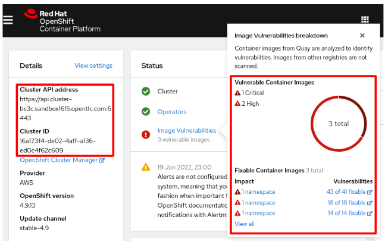

.quay-peer
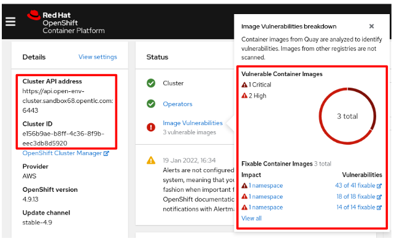

.Quay Security Scan
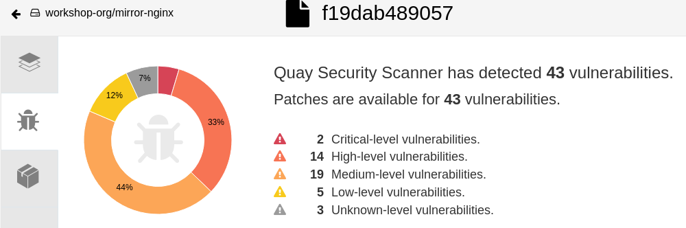

== Navigation

link:../03.Repo-Mirroring/README.adoc[[Previous]]