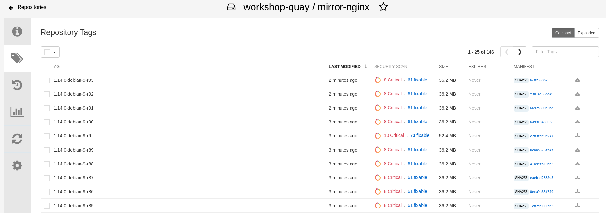
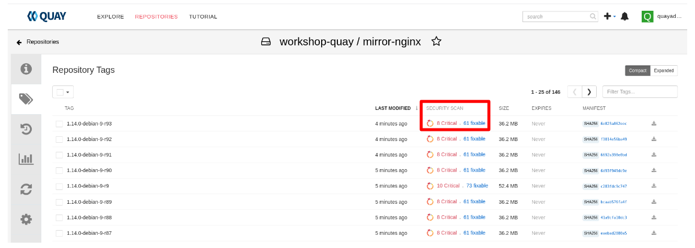
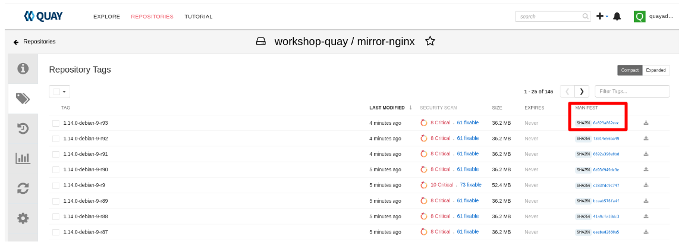
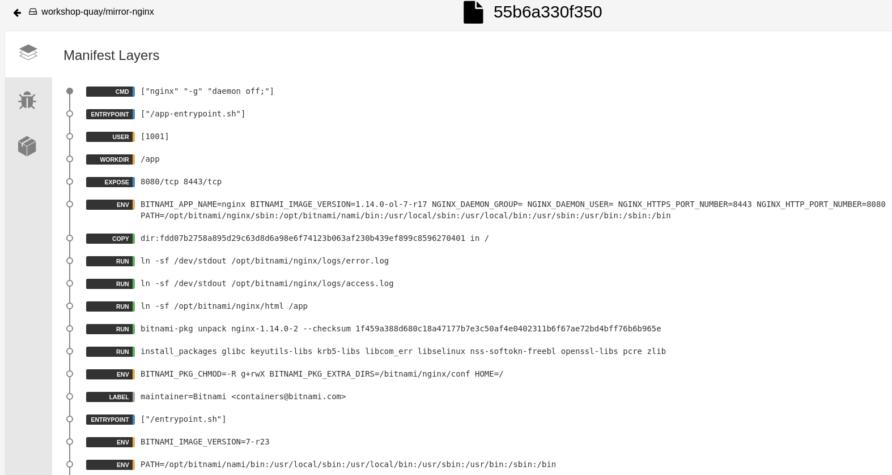
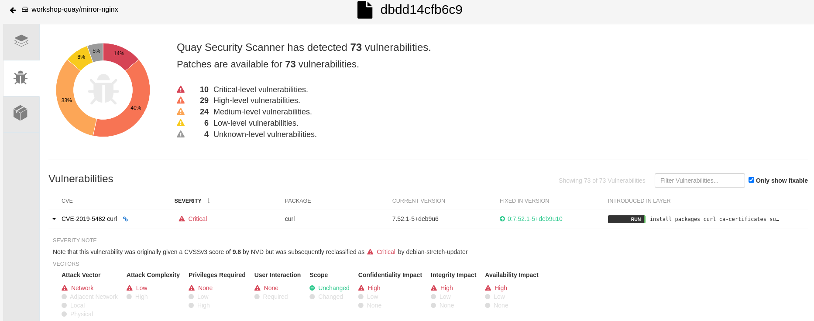
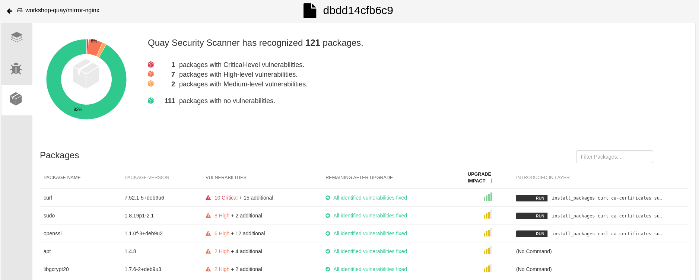

= 04 Inspecting image layers and CVE's

* Navigate to the `workshop-quay/mirror-nginx` repository.
* Click the Tags icon on the left.
+

+
* You can pick any image, with several `High` and `fixable` results shown under the `SECURITY SCAN` field. Let's explore this one.
+

+
* Now let's explore the `SHA256` value, listed under `MANIFEST`
+

+
* You should now see the layers dashboard as depicted in the image below
+

+
* Quay has extracted the various Dockerfile directives that comprise this image. Inspect the 3 directives included in this image `CMD`, `ENTRYPOINT`, and `USER`. This feature is very useful when inspecting complex images that intend to run applications.
* Click the `Security Scan` icon on the left, depicted in the image below.
+

+
* You should now see the Security Scan Dashboard like the picture, similar to the picture below:
+

+
* Click the `Packages` icon on the left, depicted in the image below.
+

+
* You should now see the Packages Dashboard like the picture, similar to the picture below:
+
